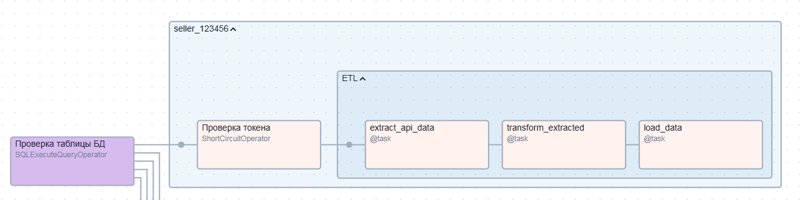

# iSeller

<hr>

Copy _iseller_ to _/opt/airflow/dags/iseller_

## Wildberries ETL

### Method "A"
Variable key: **_iseller_wildberries_sellers_**<br>
JSON:
```json
[
  {
    "id": 123456,
    "name": "Shop name",
    "token": "eyJhbGciOiJFUzI1NiIsImt..."
  }
]
```
PostgreSQL conn id: **_iseller_wildberries_**

### Method "B"
iseller.env
```ini
ISELLER_WB_DB_HOST=host.docker.internal
ISELLER_WB_DB_PORT=5432
ISELLER_WB_DB_USER=root
ISELLER_WB_DB_PASSWORD=password
ISELLER_WB_DB=wildberries_api

ISELLER_WB_JSON_SELLERS=[{"id": 123456, "name": "Shop name", "token": "eyJhbGciOiJFUzI1NiIsImt..."}]
```

```
docker exec --user airflow --env-file iseller.env airflow-worker /bin/sh -c "python3 /opt/airflow/dags/iseller/wb/config.py"
```
<br>
